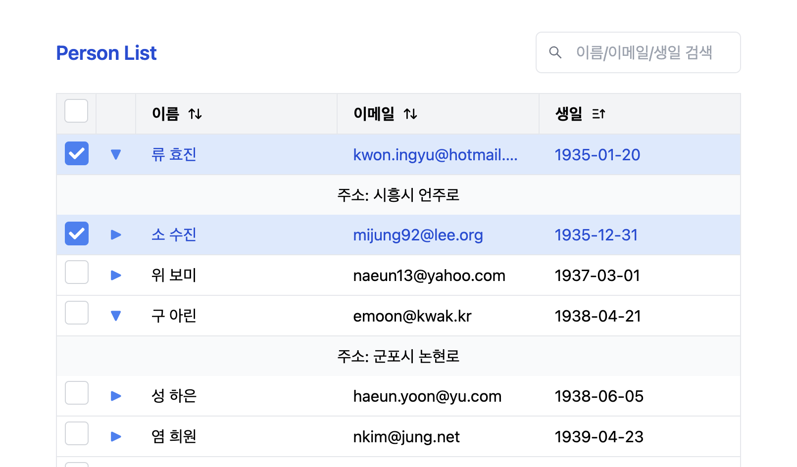

# React Table Challenge

React와 Tailwind CSS를 사용하여 정렬, 검색, 무한 스크롤을 포함한 동적인 테이블 구현 프로젝트입니다.

## 기술 스택

- **TypeScript**: 정적 타입 지원
- **React**: 용자 인터페이스 구축
- **React Router**: 라우팅 및 쿼리 스트링 처리
- **Tailwind CSS**: 스타일링
- **Axios**: HTTP 요청을 관리하여 API와 통신
- **React Query**: 데이터 패칭 및 상태 관리
- **React Icons**: UI 구성에 필요한 아이콘 사용

## 화면



## 기능

- **정렬**: 컬럼별 오름차순, 내림차순 정렬 가능.
- **검색**: 키워드 기반으로 fullname, email, birthday 필드 검색 가능.
- **무한 스크롤**: 데이터를 점진적으로 로드하여 성능 최적화.
- **사용자 정의 가능**: 헤더, 행, 셀 등의 컴포넌트를 쉽게 확장하거나 교체 가능.
- **툴팁**: 셀 데이터가 셀 너비를 초과할 경우 마우스오버 시 툴팁 표시.
- **서브 행**: 각 행을 클릭하면 address 정보를 세부 행으로 표시.

## 프로젝트 요구 사항

- ✅ 테이블: 테이블 관련 라이브러리 사용 하지 않고 구현.
- ✅ 체크박스: 테이블 각 행에 체크박스를 추가하여 다중 선택 가능.
- ✅ 무한 스크롤: Intersection Observer를 사용해 데이터 로드 구현.
- ✅ 정렬 기능: 컬럼 별 정렬 가능하며, 정렬 상태를 URL 쿼리 스트링으로 관리.
- ✅ 검색 기능: 테이블 외부에 검색 입력 필드를 배치하고 검색어와 연동.
- ✅ 데이터 처리: 최소 100개 이상의 데이터를 원활하게 처리.
- ✅ 컬럼 정의: fullname, email, birthday, address 등 자유롭게 설정.
- ✅ 툴팁 구현: 셀 데이터가 길 경우 마우스오버 시 전체 내용 표시.
- ✅ 서브 행 구현: address 데이터를 세부 행으로 노출.

## 시작하기

### 필수 조건

- Node.js (>= 16.16.0)
- npm 또는 yarn

### 설치

1. 프로젝트 클론:

```bash
git clone https://github.com/zooyaho/react-table-challenge.git
cd react-table-challenge
```

2. 의존성 설치:

```bash
npm install
# 또는
yarn install
```

3. 개발 서버 실행:

```bash
npm start
# 또는
yarn start
```

4. 브라우저에서 http://localhost:3000로 이동하여 확인하세요.

## 프로젝트 구조

```bash
src/
├── apis/                           # API 관련 파일
│   ├── person/                     # person 데이터 관련 API
│   │   ├── personApi.query.ts      # React Query 사용한 custom hook
│   │   ├── personApi.ts            # person API 호출 함수
│   │   ├── personApi.type.ts       # person API 관련 타입 정의
│   ├── axiosInstance.ts
│   ├── queryClient.ts
│
├── components/
│   ├── common/                     # 공통 컴포넌트
│   │   ├── Checkbox/               # 체크박스 컴포넌트
│   │   ├── input/                  # 입력 필드 관련 컴포넌트 폴더
│   │   │   ├── BasicInput.tsx      # 기본 입력 필드
│   │   │   ├── SearchInput.tsx     # 검색 입력 필드
│   │   │   └── index.ts
│   │   ├── table/                  # 테이블 관련 컴포넌트 폴더
│   │   │   └── CheckBoxTable/      # 체크박스가 포함된 테이블 컴포넌트
│   │   ├── Tooltip/                # 툴팁 컴포넌트
│   ├── person/
│   │   ├── PersonTable/            # person 테이블 컴포넌트
│   │   │   ├── PersonTable.data.tsx # person 테이블 관련 데이터
│   │   │   ├── PersonTable.tsx     # person 테이블 UI 및 로직
│   │   │   ├── PersonTable.type.ts # person 테이블 타입 정의
│   │   │   ├── usePersonTable.ts   # 비즈니스 로직
│   │   │   └── index.ts
│   │   ├── PersonTableHeader/      # person 테이블 헤더 컴포넌트
│
├── constants/                      # 상수 정의
│   ├── apiPaths.ts                 # API 경로 정의
│   ├── routes.ts                   # 라우트 경로 정의
│
├── pages/                          # 페이지 컴포넌트
│   ├── PersonPage/                 # PersonPage 컴포넌트
│   │   ├── PersonPage.tsx
│   │   └── index.ts
│
├── providers/                      # 전역 상태 관리 및 프로바이더
│   ├── Providers.tsx               # 프로바이더 정의
│   ├── TanstackQueryProvider.tsx   # React Query Provider 설정
│   └── index.ts
│
├── routes/                         # 라우팅 설정
│   └── AppRoutes.tsx
│
├── types/                          # 타입 정의
│   ├── person/                     # person 데이터 타입 정의
│   │   └── person.type.ts
```

## 문제 해결 방식

1. **테이블:**

- 제네릭 타입을 지원하여 다양한 데이터 구조에 대응할 수 있도록 설계.

2. **서브 행(Sub Rows):**

- 각 행에 클릭 버튼을 추가하여 서브 행을 확장하거나 축소할 수 있도록 구현.
- 클릭 시 해당 행의 추가 데이터를 표시하며, 서브 행 데이터는 renderSubRow를 통해 커스터마이징 가능.

3. **툴팁(Tooltip):**

- 테이블 셀 데이터가 길어질 경우 onMouseEnter 이벤트를 사용해 툴팁을 표시하도록 구현.
- 툴팁 위치는 getBoundingClientRect로 계산하여 가운데 위치에 렌더링.

4. **무한 스크롤(Infinite Scroll):**

- Intersection Observer API를 활용해 스크롤 위치를 감지하고, 마지막 데이터가 뷰포트에 노출되면 추가 데이터를 로드하도록 구현.
- React Query의 useInfiniteQuery를 사용해 서버에서 데이터를 비동기로 페칭하고 페이지네이션을 처리.
- 서버 API가 페이지 관련 정보를 제공하지 않는 상황을 고려하여, getPaginatedPersons 함수에서 직접 페이지네이션 로직을 구현:
  - 데이터 변환: API 호출 후 반환 데이터를 가공하여 fullname, addressName 등 추가 필드를 생성.
  - hasMore 플래그: API의 반환 데이터 개수를 기반으로 다음 페이지 유무를 계산하여 hasMore 플래그를 설정.

5.  **검색(Search)**:

- 검색 입력 필드(SearchInput)는 React.forwardRef를 사용해 비제어 컴포넌트로 구현.
- onKeyDown 이벤트로 Enter 키 입력 시 검색어를 URL 쿼리 스트링(keyword)에 설정하여 상태와 동기화.
- 페이지 새로고침 시 쿼리 스트링의 keyword 값과 SearchInput의 값이 동기화되도록 useEffect를 통해 처리.

6. **정렬(Sorting):**

- 각 컬럼에 정렬 버튼을 추가하고 클릭 시 sortKey와 sortOrder를 URL 쿼리 스트링에 저장.
- 정렬 상태는 useMemo를 사용해 데이터를 정렬 후 반환하도록 구현.
- 정렬 순서(오름차순/내림차순/초기화)는 상태를 기반으로 토글되도록 설정.

7. **비즈니스 로직 분리:**

- PersonTable의 비즈니스 로직을 usePersonTable 커스텀 훅으로 분리하여 UI와 로직을 분리.
- usePersonTable에서 데이터 페칭, 무한 스크롤 감지, 상태 관리 등의 기능을 처리.
- 로직 분리를 통해 PersonTable 컴포넌트는 UI 렌더링에 집중하도록 구조를 단순화.

8. **전체 프로젝트 구조 개선:**

- 공통 컴포넌트를 재사용 가능하게 설계하여 유지보수와 확장성 강화.
- 쿼리 스트링을 활용해 URL 상태와 UI 상태를 일치시키는 방향으로 문제를 해결.
